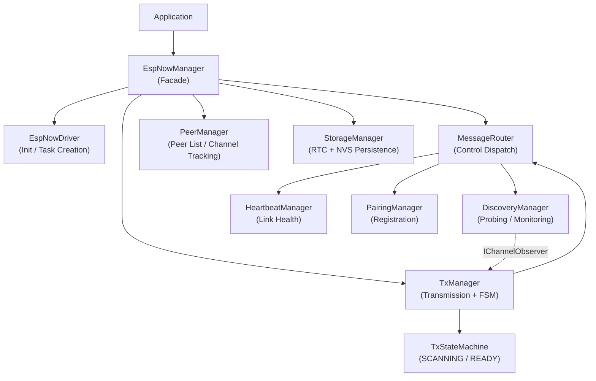
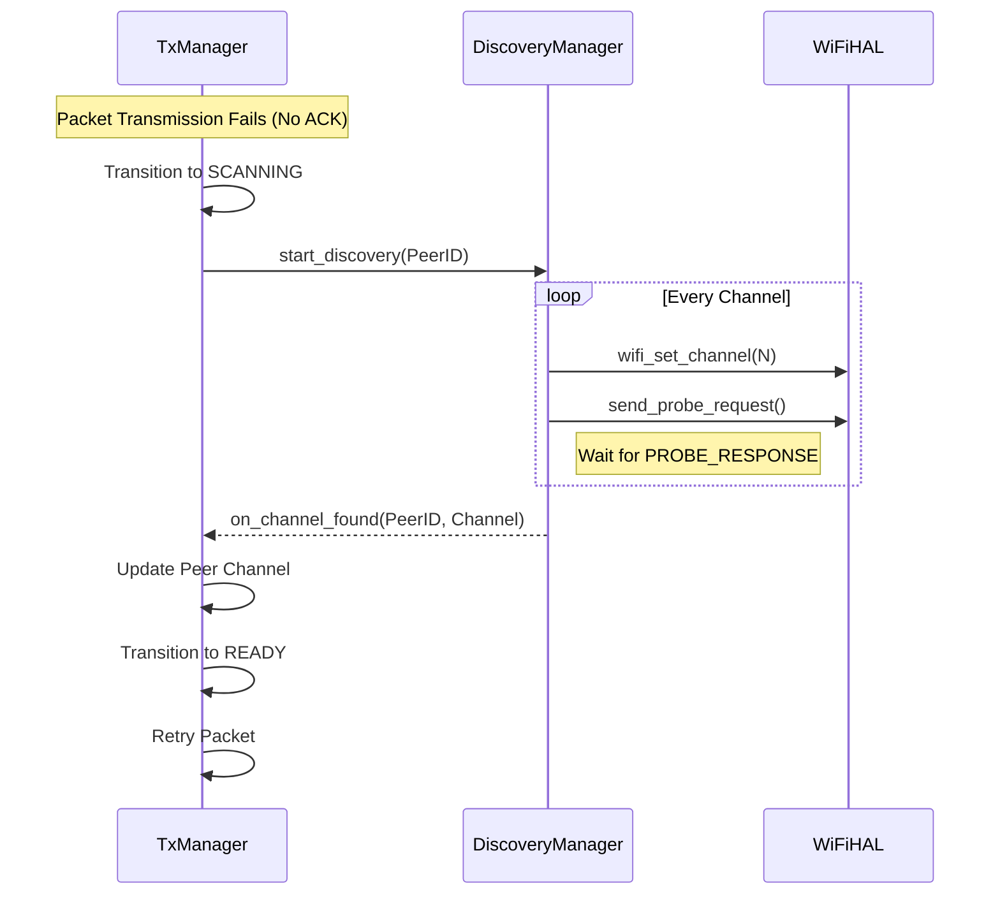

# ESP-NOW Manager — Internal Design

This document explains the internal architecture, component responsibilities, message flows, and the rationale behind key design decisions of the `espnow_manager` component.

---

## 1. Architecture Overview

The `espnow_manager` component follows a **Facade + Decentralized Managers** pattern. `EspNowManager` serves as the public entry point, while logic is distributed among specialized managers that adhere to the Single Responsibility Principle (SRP).

---

## 2. Components

| Component | Role | Driven By |
|---|---|---|
| `EspNowManager` | Public API, Singleton Orchestrator | Application |
| `EspNowDriver` | ESP-NOW init, Task & Queue creation | `EspNowManager` |
| `MessageRouter` | Pure delegator for control messages | `rx_dispatch_task` |
| `TxManager` | Packet queueing and retry logic | `transport_worker_task` |
| `TxStateMachine` | Manages transmission states (READY / SCANNING) | `TxManager` |
| `DiscoveryManager` | Multi-channel probing and channel discovery | `MessageRouter` |
| `HeartbeatManager` | Link monitoring and offline detection | `MessageRouter` |
| `PairingManager` | Node registration and channel sync | `MessageRouter` |
| `PeerManager` | Peer database and MAC-to-Channel mapping | Various Managers |
| `StorageManager` | High-level data persistence logic | `PeerManager` |
| `RtcBackend` | RTC memory persistence (Deep Sleep survivors) | `StorageManager` |
| `NvsBackend` | NVS flash persistence (Long-term storage) | `StorageManager` |
| `MessageCodec` | Protocol serialization and CRC validation | `MessageRouter`, `TxManager` |

---

## 3. High-Level Logic

### EspNowManager (The Facade)
The orchestrator. It owns all manager instances and ensures they are correctly wired together (Dependency Injection). It propagates system-wide events, such as WiFi channel updates, to all sub-components.

### EspNowDriver
Encapsulates the complexity of ESP-NOW initialization, callback registration, and FreeRTOS resource allocation (Queues, Tasks, Mutexes). It abstracts the low-level lifecycle from the business logic.

### MessageRouter
Acts as the central dispatcher for control messages. It avoids redundant decoding by passing a pre-decoded `MessageHeader` to specialized managers (`DiscoveryManager`, `HeartbeatManager`, `PairingManager`). It is stateless and does not create packets.

### TxManager & TxStateMachine
The core of the transmission reliability. When a packet fails to reach its destination (No ACK), the `TxStateMachine` transitions to `SCANNING`. In this state, the `DiscoveryManager` is triggered to find the peer's current channel. Once discovered, the `TxManager` updates the peer information and resumes transmission.

### DiscoveryManager
Specializes in finding peers on different WiFi channels. It sends `PROBE_REQUEST` packets and listens for `PROBE_RESPONSE`. It implements an observer pattern to notify the `TxManager` when a peer is found on a new channel.

### HeartbeatManager
Maintains the "alive" status of nodes. It periodically sends `HEARTBEAT_REQUEST` and expects `HEARTBEAT_RESPONSE`. It uses an internal timer and a configurable interval to track and report offline nodes to the upper layers.

### PairingManager
Handles the initial link between a HUB and a SENSOR. It negotiates node IDs and synchronizes the initial WiFi channel. It uses the `IPersistenceBackend` to ensure paired information is available immediately after a reboot.

### PeerManager & Storage
Manages the list of known nodes. It decouples the "where to store" (Backends) from the "when to store" (Manager). It uses `RTC_DATA_ATTR` via `RtcBackend` to preserve peer lists through deep sleep cycles.

---

## 4. Message Flows

### Channel Discovery Flow
When a node moves to a different channel, the sender must find it.

---

## 5. Design Decisions

### Dependency Injection & Interface-Based Design
Every manager depends on interfaces (`IFreeRTOSHAL`, `IWiFiHAL`, `ITxManager`, etc.) rather than concrete implementations. This allows 100% testability on host (Linux) by injecting Mocks using GoogleMock, without needing real hardware or FreeRTOS binaries.

### Single Responsibility Principle (SRP)
Logic is strictly partitioned:
- `MessageRouter` only **routes**.
- `DiscoveryManager` only **discovers**.
- `TxManager` only **transmits**.
- `StorageManager` only **persists**.
This prevents the "Big Manager" anti-pattern and makes the codebase easier to maintain and extend.

### HAL Abstraction (FreeRTOS & WiFi)
Direct calls to FreeRTOS (`xTaskCreate`, `xSemaphoreTake`) and ESP-IDF (`esp_now_send`, `esp_wifi_set_channel`) are forbidden inside business logic managers. They must go through the respective HAL interfaces. This is the cornerstone of the project's portability and testability.

### RTC Memory Persistence
The use of `RTC_DATA_ATTR` via `RtcBackend` is a strategic decision for IoT devices. It allows the `EspNowManager` to enter Deep Sleep and wake up with its peer list ready in microseconds, without the power cost or latency of reading from flash (NVS). It relies on CRC validation to ensure data integrity.
