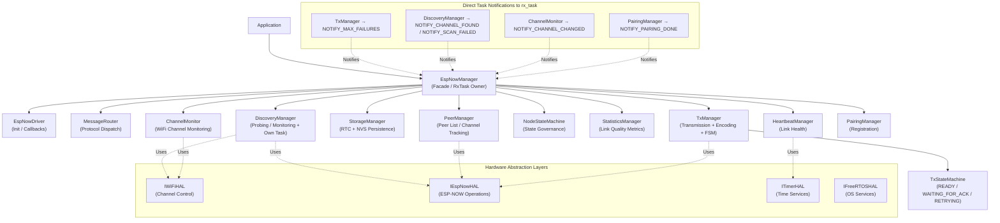
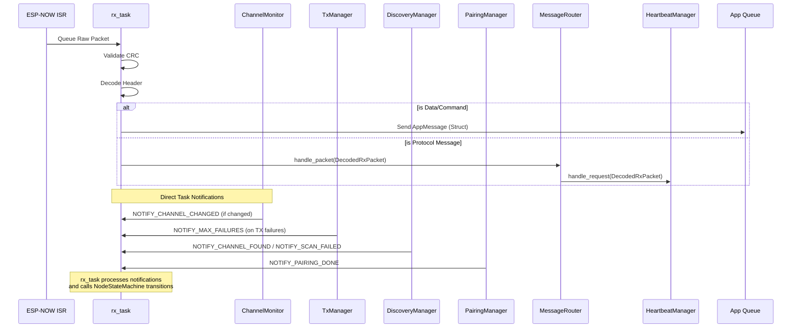
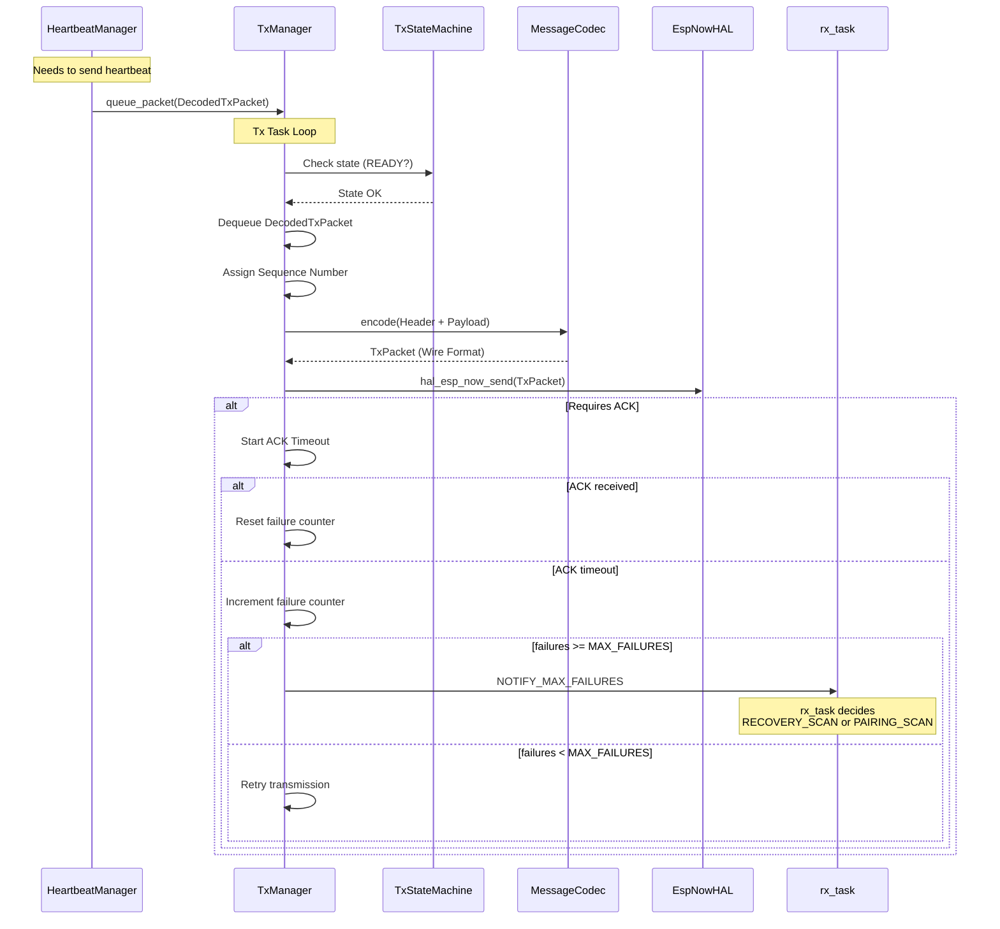
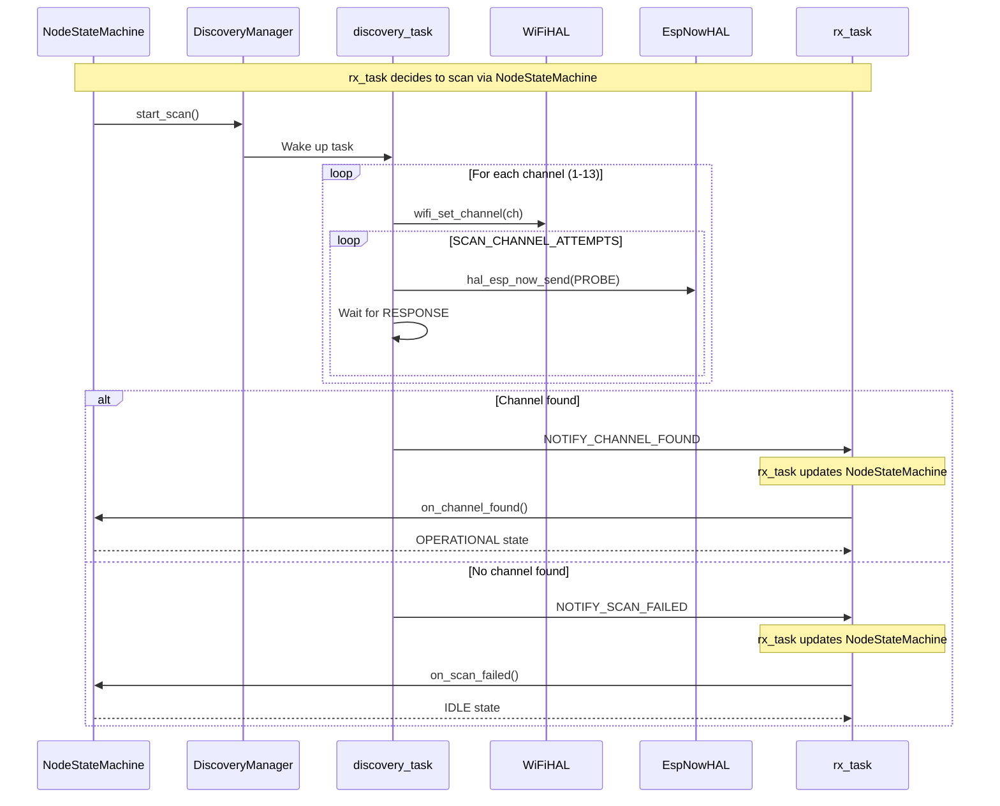

# ESP-NOW Manager — Internal Design

This document explains the internal architecture, component responsibilities, message flows, and the rationale behind key design decisions of the `espnow_manager` component.

---

## 1. Architecture Overview

The `espnow_manager` component follows a **Facade + Decentralized Managers** pattern. `EspNowManager` serves as the public entry point and orchestrates specialized managers. The architecture uses **separated hardware abstraction layers** for WiFi and ESP-NOW to enable fine-grained control and testability.

**Critical Design Point:** `rx_task` is the central decision-making hub. All managers notify `rx_task` directly via FreeRTOS task notifications, and `rx_task` uses `NodeStateMachine` to manage state transitions.



---

## 2. Components

| Component | Role | HAL Dependencies | Driven By |
|---|---|---|---|
| `EspNowManager` | Public API, Singleton Orchestrator, **RX Task Owner** | IWiFiHAL, IEspNowHAL, ITimerHAL, IFreeRTOSHAL | Application |
| `EspNowDriver` | ESP-NOW init, ESP-IDF callback registration | IEspNowHAL | `EspNowManager` |
| `MessageRouter` | Dispatches `DecodedRxPacket` to specific managers | None (stateless) | `rx_task` |
| `TxManager` | **Centralized Encoding**, Packet queueing, retry logic, FSM | IEspNowHAL, IFreeRTOSHAL, ITimerHAL | `tx_task` |
| `TxStateMachine` | Manages transmission states (READY / WAITING_FOR_ACK / RETRYING) | None | `TxManager` |
| `DiscoveryManager` | Multi-channel probing and channel discovery | **IWiFiHAL**, **IEspNowHAL**, IFreeRTOSHAL | **Own task** (`discovery_task`) |
| `HeartbeatManager` | Link monitoring and keep-alive generation | ITimerHAL | `MessageRouter` |
| `PairingManager` | Node registration and channel sync | IFreeRTOSHAL | `MessageRouter` |
| `PeerManager` | Peer database and MAC-to-Channel mapping | **IEspNowHAL**, IFreeRTOSHAL | Various Managers |
| `StorageManager` | High-level data persistence logic | IStorageManager (NVS/RTC) | `PeerManager` |
| `ChannelMonitor` | WiFi channel change detection | **IWiFiHAL**, IFreeRTOSHAL | `rx_task` |
| `StatisticsManager` | Per-peer link quality metrics (RSSI, RTT, loss) | IFreeRTOSHAL | `rx_task`, `tx_task` |
| `NodeStateMachine` | High-level node state governance | None (pure state machine) | `EspNowManager` |
| `MessageCodec` | Protocol serialization and CRC validation | None (pure logic) | `TxManager`, `EspNowManager`, `DiscoveryManager` |

### EspNowManager (The Facade & RX)
The orchestrator. It owns all manager instances and ensures they are correctly wired together. It owns the single **`rx_task`**, which handles:
1.  Receiving raw packets from the ISR queue.
2.  Validating CRC and decoding headers.
3.  Delivering application data directly to the user queue (`AppMessage`).
4.  Delegating protocol messages to `MessageRouter` via `DecodedRxPacket`.
5.  **Receiving direct task notifications from managers** (TxManager, DiscoveryManager, ChannelMonitor, PairingManager).
6.  Notifying managers of state transitions via `NodeStateMachine`.
7.  Calling `handle_state_transition()` to coordinate managers based on state changes.

### TxManager (The Transmitter)
The core of outbound reliability. It strictly owns the **Encoding** responsibility.
-   **Input:** `DecodedTxPacket` (Structured data: header + payload + destination).
-   **Process:** Encodes structure to wire format (`TxPacket`), calculates CRC, assigns sequence numbers.
-   **Output:** Calls `hal_espnow_->hal_esp_now_send`.
-   **Logic:** Handles retries, ACK timeouts, and **notifies `rx_task` directly via `NOTIFY_MAX_FAILURES`** when physical transmission failures reach `MAX_FAILURES`.
-   **State Machine:** Uses `TxStateMachine` to track transmission states (READY, WAITING_FOR_ACK, RETRYING). **Does NOT have SCANNING state** — scanning decisions are made by `rx_task` via `NodeStateMachine`.

### MessageRouter
A pure logic router. It receives fully decoded packets (`DecodedRxPacket`) from the `rx_task` and dispatches them to the appropriate manager (`Pairing`, `Heartbeat`, `Discovery`) based on `MessageType`. It is stateless and does not decode data.

### DiscoveryManager (Dual HAL Usage + Own Task)
The only manager that uses **both** WiFi and ESP-NOW HALs **and runs its own FreeRTOS task**:
-   **IWiFiHAL:** For channel scanning (`wifi_set_channel`, `wifi_get_channel`).
-   **IEspNowHAL:** For sending probe packets during discovery (`hal_esp_now_send`).
-   **Task:** `DiscoveryManager::discovery_task()` runs a synchronous scan loop.
-   **Initialization:** Receives `rx_task_handle` via `init()` parameter to enable direct notifications.
-   **Notifications:** Notifies `rx_task` directly when channel is found or scan fails:
    ```cpp
    hal_freertos_.task_notify(rx_task_handle_, NOTIFY_CHANNEL_FOUND, eSetBits);
    hal_freertos_.task_notify(rx_task_handle_, NOTIFY_SCAN_FAILED, eSetBits);
    ```
-   **No Callbacks:** Does NOT use observer pattern — direct task notification only.

### ChannelMonitor (WiFi-Only + Direct Notification)
Monitors WiFi channel changes using only **IWiFiHAL**:
-   Periodically checks current channel via `wifi_get_channel`.
-   **Notifies `rx_task` directly** via task notifications when channel changes:
    ```cpp
    hal_freertos_.task_notify(rx_task_handle_, NOTIFY_CHANNEL_CHANGED, eSetBits);
    ```
-   Enables automatic channel recovery when HUB changes channels.

### Specialized Managers (Heartbeat, Pairing)
These managers contain the business logic for their respective protocols.
-   **Input:** `DecodedRxPacket` (from Router).
-   **Output:** `DecodedTxPacket` (queued to `TxManager`).
-   **HeartbeatManager:** Uses `ITimerHAL` for timestamps.
-   **PairingManager:** Uses `IFreeRTOSHAL` for task notifications to `rx_task` (`NOTIFY_PAIRING_DONE`).

---

## 3. Node State Machine

The `NodeStateMachine` governs the high-level state of the ESP-NOW node. States and transitions:

### States

| State | Description |
|-------|-------------|
| `UNINITIALIZED` | Initial state before `init()` is called |
| `IDLE` | Initialized, no peers, waiting for pairing |
| `PAIRING_SCAN` | Scanning for HUB to initiate pairing |
| `PAIRING` | Actively exchanging pairing messages |
| `OPERATIONAL` | Has peers, normal communication |
| `RECOVERY_SCAN` | Lost connection, scanning to recover |

### State Transition Table

```
| Current State   | Event                  | New State     | Condition / Rationale                        |
| :-------------- | :--------------------- | :------------ | :------------------------------------------- |
| UNINITIALIZED   | on_init                | OPERATIONAL   | has_peers == true                            |
| UNINITIALIZED   | on_init                | PAIRING_SCAN  | has_peers == false → Auto-start pairing      |
| IDLE            | on_pairing_requested   | PAIRING_SCAN  | has_peers == false → Need to find HUB        |
| IDLE            | on_pairing_requested   | PAIRING       | has_peers == true → HUB already on channel   |
| OPERATIONAL     | on_pairing_requested   | PAIRING       | has_peers == true → Already on channel       |
| OPERATIONAL     | on_pairing_requested   | PAIRING_SCAN  | has_peers == false → No peers, need scan     |
| OPERATIONAL     | on_scan_requested      | RECOVERY_SCAN | Link lost, try to find channel               |
| PAIRING_SCAN    | on_channel_found       | PAIRING       | Channel found, ready to pair                 |
| PAIRING_SCAN    | on_scan_failed         | IDLE          | No HUB found. App can retry.                 |
| RECOVERY_SCAN   | on_channel_found       | OPERATIONAL   | Back to normal                               |
| RECOVERY_SCAN   | on_scan_failed         | IDLE          | Channel lost and not rediscovered.           |
| PAIRING         | on_pairing_timeout     | OPERATIONAL   | success == true                              |
| PAIRING         | on_pairing_timeout     | IDLE          | success == false && has_peers == false       |
| PAIRING         | on_pairing_timeout     | OPERATIONAL   | success == false && has_peers == true        |
```

---

## 4. Key Workflows

### 4.1. Reception Flow (Unified RX Task with Direct Notifications)

The `rx_dispatch_task` and `transport_worker_task` have been merged into a single `rx_task` for efficiency.
**Critical:** `rx_task` receives **direct task notifications** from multiple managers.



**Key Points:**
- `rx_task` is the **central decision hub** — all managers notify it directly.
- Task notifications are **asynchronous** — `rx_task` processes them in its main loop.
- `rx_task` uses `NodeStateMachine` to determine valid state transitions.
- `rx_task` calls `handle_state_transition()` to coordinate manager actions on state changes.

### 4.2. Transmission Flow (Structured TX + Failure Notifications)

Transmission logic is centralized. Managers "fire and forget" structured data.



**Key Points:**
- `TxManager` monitors physical transmission failures internally.
- When failures reach `MAX_FAILURES`, `TxManager` **notifies `rx_task` directly** via `NOTIFY_MAX_FAILURES`.
- `TxManager` does **NOT** trigger scanning or state changes — it only reports failures.
- `rx_task` receives the notification and uses `NodeStateMachine` to decide the appropriate action (RECOVERY_SCAN or PAIRING_SCAN based on peer count).

### 4.3. Discovery Scan Flow (DiscoveryManager Task + Direct Notifications)



**Key Points:**
- `DiscoveryManager` has its **own task** (`discovery_task`) that runs the synchronous scan loop.
- `rx_task_handle` is passed to `DiscoveryManager::init()` to enable direct notifications.
- DiscoveryManager **notifies `rx_task` directly** — it does NOT call `NodeStateMachine` methods directly.
- `rx_task` receives the notification and calls the appropriate `NodeStateMachine` transition method.
- This decouples the scan logic from state management — `DiscoveryManager` only reports results.
```

---

## 5. Design Decisions

### Separated HALs (IWiFiHAL vs IEspNowHAL)
**Decision:** Split WiFi and ESP-NOW operations into separate interfaces.
-   **Reason:** WiFi channel control (`esp_wifi_set_channel`) is logically distinct from ESP-NOW operations (`esp_now_send`). Some components (e.g., `ChannelMonitor`, `DiscoveryManager`) need WiFi control without ESP-NOW, while others (e.g., `TxManager`, `PeerManager`) need ESP-NOW without WiFi control.
-   **Benefit:** Finer-grained dependency injection, clearer component responsibilities, improved testability (mock only what's needed).

### Structured Data vs. Raw Buffers
**Decision:** Pass `DecodedRxPacket` (RX) and `DecodedTxPacket` (TX) between components instead of raw byte buffers.
-   **Reason:** Eliminates redundant decoding steps. Previously, the `rx_task` decoded the header, but passed the raw buffer to managers, which had to decode it *again*. Now, decoding happens once at ingress (`rx_task`), and encoding happens once at egress (`TxManager`).
-   **Benefit:** Improved CPU efficiency and type safety. Managers operate on structs, not bytes.

### Unified RX Task
**Decision:** Merge the dispatch and worker tasks.
-   **Reason:** The original split was to prevent slow protocol logic from blocking the ISR queue. However, current protocol handlers are non-blocking (state updates + queueing a TX packet).
-   **Benefit:** Saves ~2-4KB of RAM (stack + queue overhead) and reduces context switching.

### Centralized Encoding in TxManager
**Decision:** Move `MessageCodec::encode` usage exclusively to `TxManager`.
-   **Reason:** Ensures a single point of truth for Sequence Numbers and CRC generation. Managers no longer need to know *how* to serialize data, only *what* to send.
-   **Benefit:** Simplifies unit tests for managers (no need to mock Codec) and enforces protocol consistency.

### DiscoveryManager Scan Exception
**Decision:** `DiscoveryManager::scan()` calls `hal_esp_now_send` directly, bypassing the `TxManager` queue.
-   **Reason:** Scanning is a synchronous, blocking operation that runs in `DiscoveryManager`'s own task (`discovery_task`). Queueing probe packets to `TxManager` while the discovery task is waiting for responses would add unnecessary complexity and potential race conditions.
-   **Trade-off:** Accepted deviation for the specific "Scan and Wait" pattern. Consequently, `DiscoveryManager` retains a dependency on `IMessageCodec` to encode these probe packets locally.
-   **Note:** `DiscoveryManager` does **NOT** manage state transitions — it only reports results to `rx_task` via task notifications.

### Direct Task Notifications Over Observer Pattern
**Decision:** Managers notify `rx_task` directly via FreeRTOS task notifications instead of using observer interfaces.
-   **Reason:** The original design used `IChannelObserver` and `ITxFailureObserver` callbacks. This added unnecessary indirection and coupling between managers. Direct task notifications are simpler, more efficient, and align with FreeRTOS best practices.
-   **Benefit:** Reduced coupling, simpler interfaces, no callback registration overhead, clearer data flow.
-   **Notifications Used:**
    - `TxManager` → `rx_task`: `NOTIFY_MAX_FAILURES`
    - `DiscoveryManager` → `rx_task`: `NOTIFY_CHANNEL_FOUND`, `NOTIFY_SCAN_FAILED`
    - `ChannelMonitor` → `rx_task`: `NOTIFY_CHANNEL_CHANGED`
    - `PairingManager` → `rx_task`: `NOTIFY_PAIRING_DONE`

### rx_task as Central Decision Hub
**Decision:** All state transition decisions flow through `rx_task`, which uses `NodeStateMachine` for validation.
-   **Reason:** Centralizing decision logic prevents scattered state management and ensures consistent transitions. Managers only report events — they do not decide state changes.
-   **Benefit:** Single source of truth for state transitions, easier debugging, clearer separation of concerns (managers report, `rx_task` decides).

### ITimerHAL Returns int64_t
**Decision:** `ITimerHAL::get_time_us()` returns `int64_t` (matching ESP-IDF's `esp_timer_get_time()`).
-   **Reason:** ESP-IDF's native API returns `int64_t`. Wrapping to `uint64_t` would require unnecessary casting and could introduce sign-related bugs.
-   **Benefit:** Direct compatibility with ESP-IDF, no conversion overhead.

### Automatic WiFi Channel for Peers (Channel 0)
**Decision:** All peers are registered with ESP-NOW using channel 0 (automatic), not a fixed channel.
-   **Reason:** When a peer is registered with a specific channel (e.g., channel 6), but the WiFi interface changes to a different channel (e.g., channel 11), ESP-NOW does **not** automatically update the peer's channel. This causes transmission failures until the peer is manually updated. Using channel 0 (automatic) means peers always use whatever channel the WiFi interface is currently set to.
-   **Trade-off:** When the HUB changes channels, nodes cannot communicate until they detect the failure and complete a full channel scan. However, this is already handled by the `RECOVERY_SCAN` state triggered by `MAX_FAILURES` transmission failures.
-   **Alternative Considered:** Storing the channel in each `PeerInfo` and updating all peers when the channel changes. This was rejected because:
    - Requires iterating through all registered peers on every channel change
    - Each `hal_esp_now_mod_peer()` call has overhead and can fail
    - Adds complexity to channel change handling
    - Provides no benefit over automatic channel + scan recovery
-   **Benefit:** Simplified peer management — no need to track or update peer channels. Channel changes are handled uniformly through the existing recovery scan mechanism.

---

## 11. Statistics Manager

The `StatisticsManager` tracks per-peer network quality metrics using Exponential Moving Averages (EMA) for RSSI and RTT, along with packet counters. It persists statistics to storage when event-specific dirty thresholds are reached.

### Tracked Metrics (Per-Peer)

| Metric | Description | Update Method |
|--------|-------------|---------------|
| `rssi_last` | Last received RSSI (dBm) | Direct from `RxPacket::rssi` |
| `rssi_avg` | EMA of RSSI | `update_ema_i8()` with adaptive alpha |
| `packets_rx` | Total packets received | Increment on each valid packet |
| `packets_sent` | Successfully transmitted over the air (callback `ESP_NOW_SEND_SUCCESS`) | `on_delivery_success()` |
| `delivery_failures` | MAC/PHY transmission failures (callback `ESP_NOW_SEND_FAIL`) | `on_delivery_failure()` |
| `driver_errors` | `hal_esp_now_send()` returned error (`NO_MEM`, `CHAN`, etc.) | `on_driver_error()` |
| `packets_lost` | ACK timeout after retries exhausted (application-level loss) | `on_packet_lost()` |
| `retries` | Number of retransmissions | `on_retry()` |
| `rtt_last_ms` | Last round-trip time | `current_time_ms - sent_timestamp_ms` |
| `rtt_avg_ms` | EMA of RTT | `update_ema_u32()` |

### Flush Thresholds

Statistics are flushed to persistent storage when any dirty counter reaches its threshold:

| Threshold | Value | Triggers Flush |
|-----------|-------|----------------|
| `FLUSH_THRESHOLD_RX` | 50 | Packet reception events |
| `FLUSH_THRESHOLD_TX` | 50 | Successful transmissions |
| `FLUSH_THRESHOLD_TX_FAILURE` | 10 | Delivery failures AND driver errors (shared) |
| `FLUSH_THRESHOLD_LOSS` | 10 | Logical ACK timeouts |
| `FLUSH_THRESHOLD_RTT` | 30 | RTT measurements |

### Delivery Event Correlation (Per-Peer)

The `StatisticsManager` now correlates ESP-NOW send callbacks with peer node IDs, enabling per-peer delivery tracking instead of a single global counter.

**Mechanism:**
1. `esp_now_send_cb` (WiFi task, priority 23) posts a `DeliveryEvent { dest_mac[6], status }` to a small queue (depth 2) via `xQueueSendFromISR()`, then sets the relevant notification bit (`NOTIFY_DELIVERY_FAILURE` or `NOTIFY_DELIVERY_SUCCESS`).
2. `TxManager::handle_notifications()` (tx_task, priority 5) drains the queue and calls `peer_mgr_.find_node_id_by_mac()` to resolve the MAC to a node ID.
3. The appropriate stats method is called: `on_delivery_success(node_id, sent_at_ms)` or `on_delivery_failure(node_id)`.

**Why a queue?** The WiFi task callback cannot safely acquire mutexes (priority 23 would block all WiFi state machines). The queue defers the lookup to the lower-priority tx_task, following ESP-IDF best practices: *"post the necessary data to a queue and process it in a lower-priority task."*

**Why depth 2?** The tx_task is single-threaded and processes notifications promptly. Depth 2 covers the edge case where a callback fires while the task is between `hal_esp_now_send()` calls.

### RSSI/RTT Initialization

RSSI and RTT averages use explicit validity flags (`PEER_STATS_FLAG_RSSI_VALID`, `PEER_STATS_FLAG_RTT_VALID` in `stats_flags` bit-field) rather than magic zero-value detection. This avoids ambiguity when a peer's actual RSSI/RTT happens to be zero.

### Mutex Timeout Strategy

- **rx/tx task callers**: 5ms timeout — prevents WiFi task starvation if the application thread holds the mutex during slow NVS operations.
- **Application thread callers** (`get()`, `get_all()`): `portMAX_DELAY` — no urgency, should always succeed.

---

## 6. HAL Interface Summary

### IWiFiHAL
WiFi driver abstraction (channel control only):
```cpp
- wifi_get_mode(wifi_mode_t *mode)
- wifi_set_channel(uint8_t primary, wifi_second_chan_t second)
- wifi_get_channel(uint8_t *primary, wifi_second_chan_t *second)
```
**Used by:** `DiscoveryManager`, `ChannelMonitor`, `EspNowManager`

### IEspNowHAL
ESP-NOW driver abstraction:
```cpp
- hal_esp_now_init()
- hal_esp_now_deinit()
- hal_espnow_register_recv_cb(esp_now_recv_cb_t cb)
- hal_espnow_register_send_cb(esp_now_send_cb_t cb)
- hal_esp_now_add_peer(const esp_now_peer_info_t *peer)
- hal_esp_now_mod_peer(const esp_now_peer_info_t *peer)
- hal_esp_now_del_peer(const uint8_t *peer_addr)
- hal_esp_now_send(const uint8_t *dest_mac, const uint8_t *data, size_t len)
```
**Used by:** `EspNowDriver`, `TxManager`, `PeerManager`, `DiscoveryManager`, `EspNowManager`

### ITimerHAL
Time services:
```cpp
- get_time_us() const → int64_t
```
**Used by:** `HeartbeatManager`, `TxManager`, `PairingManager`, `EspNowManager`

### IFreeRTOSHAL
FreeRTOS services (task, queue, semaphore, timer):
```cpp
- task_create(...), task_delete(...), task_notify(...), task_delay(...)
- queue_create(...), queue_send(...), queue_receive(...)
- semaphore_create_binary(), semaphore_take(), semaphore_give(), semaphore_delete()
- timer_create(...), timer_start(...), timer_stop(...)
```
**Used by:** All managers with tasks or synchronization needs

---

## 7. Persistence Strategy

-   **RTC RAM:** Used for the peer list. Allows the device to wake from Deep Sleep and resume ESP-NOW communication immediately without NVS latency.
-   **NVS:** Used as long-term backup. The `StorageManager` syncs RTC to NVS periodically or on critical updates (pairing).

---

## 8. Testing Strategy

-   **Host-Based Testing:** 100% of the logic is testable on Linux.
-   **Mocks:** All HALs (`IWiFiHAL`, `IEspNowHAL`, `IFreeRTOSHAL`, `ITimerHAL`) are mocked.
-   **Protocol Logic:** Managers are tested by injecting `DecodedRxPacket` inputs and verifying `DecodedTxPacket` outputs to the `MockTxManager`.
-   **Interface Injection:** Each manager depends only on the HALs it actually uses, enabling granular mocking.

---

## 9. Key Constants & Limits

```cpp
MAX_PEERS = 19                          // ESP-NOW hardware limit (20 - 1 broadcast)
MAX_PAYLOAD_SIZE = 230 bytes            // ESP_NOW_MAX_DATA_LEN - header - CRC
DEFAULT_ACK_TIMEOUT_MS = 500            // Logical ACK timeout
DEFAULT_HEARTBEAT_INTERVAL_MS = 60000   // 1 minute
MAX_FAILURES = 3                        // Retries before channel scanning
SCAN_CHANNEL_TIMEOUT_MS = 50            // Time per channel during scan
SCAN_CHANNEL_ATTEMPTS = 1               // Probes per channel
MAX_SCAN_TIME_MS = ~1300                // Full 13-channel scan budget
PAIRING_TIMEOUT_MS = 60000              // Pairing session timeout
```

---

## 10. Component Dependency Matrix

| Component | IWiFiHAL | IEspNowHAL | ITimerHAL | IFreeRTOSHAL | IMessageCodec |
|-----------|:--------:|:----------:|:---------:|:------------:|:-------------:|
| EspNowManager | ✓ | ✓ | ✓ | ✓ | ✓ |
| EspNowDriver | - | ✓ | - | - | - |
| TxManager | - | ✓ | - | ✓ | ✓ |
| TxStateMachine | - | - | - | - | - |
| DiscoveryManager | ✓ | ✓ | - | ✓ | ✓ |
| HeartbeatManager | - | - | ✓ | - | - |
| PairingManager | - | - | - | ✓ | - |
| PeerManager | - | ✓ | - | ✓ | - |
| ChannelMonitor | ✓ | - | - | ✓ | - |
| MessageRouter | - | - | - | - | - |
| NodeStateMachine | - | - | - | - | - |
| MessageCodec | - | - | - | - | - |
| StorageManager | - | - | - | - | - |

✓ = Direct dependency
