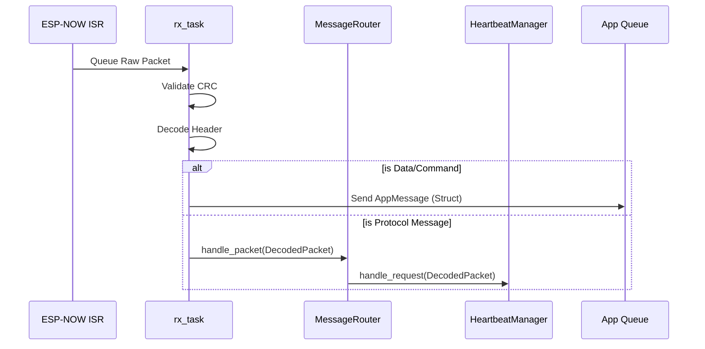
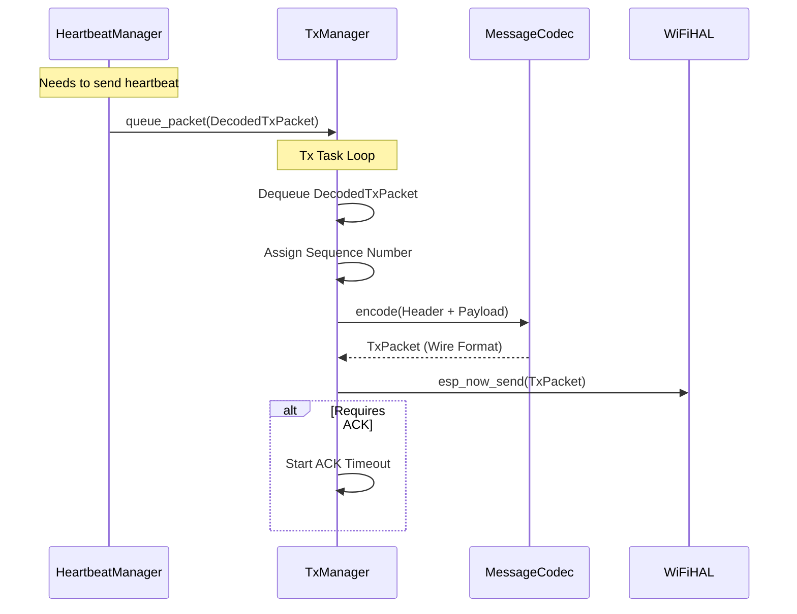

# ESP-NOW Manager — Internal Design

This document explains the internal architecture, component responsibilities, message flows, and the rationale behind key design decisions of the `espnow_manager` component.

---

## 1. Architecture Overview

The `espnow_manager` component follows a **Facade + Decentralized Managers** pattern. `EspNowManager` serves as the public entry point and orchestrates specialized managers. The architecture has evolved to centralize transmission logic and structured data handling.

```mermaid
graph TD
    App["Application"] --> EM["EspNowManager\n(Facade / RxTask)"]

    EM --> BS["EspNowDriver\n(Init / Callbacks)"]
    EM --> MR["MessageRouter\n(Protocol Dispatch)"]
    EM --> TM["TxManager\n(Transmission + Encoding + FSM)"]
    EM --> PM["PeerManager\n(Peer List / Channel Tracking)"]
    EM --> SM["StorageManager\n(RTC + NVS Persistence)"]

    MR --> DM["DiscoveryManager\n(Probing / Monitoring)"]
    MR --> HM["HeartbeatManager\n(Link Health)"]
    MR --> PR["PairingManager\n(Registration)"]

    TM --> TS["TxStateMachine\n(SCANNING / READY)"]
    
    DM -.->|IChannelObserver| TM
    
    subgraph "Data Flow"
        RX[("RX Task")] -->|DecodedPacket| MR
        MR -->|DecodedPacket| DM
        MR -->|DecodedPacket| HM
        MR -->|DecodedPacket| PR
        
        DM -->|DecodedTxPacket| TM
        HM -->|DecodedTxPacket| TM
        PR -->|DecodedTxPacket| TM
        EM -->|DecodedTxPacket| TM
        
        TM -->|TxPacket (Encoded)| BS
    end
```

---

## 2. Components

| Component | Role | Driven By |
|---|---|---|
| `EspNowManager` | Public API, Singleton Orchestrator, **RX Task Owner** | Application |
| `EspNowDriver` | ESP-NOW init, ESP-IDF callback registration | `EspNowManager` |
| `MessageRouter` | Dispatches `DecodedPacket` to specific managers | `rx_task` |
| `TxManager` | **Centralized Encoding**, Packet queueing, retry logic, FSM | `tx_task` |
| `TxStateMachine` | Manages transmission states (READY / SCANNING) | `TxManager` |
| `DiscoveryManager` | Multi-channel probing and channel discovery | `MessageRouter` |
| `HeartbeatManager` | Link monitoring and offline detection | `MessageRouter` |
| `PairingManager` | Node registration and channel sync | `MessageRouter` |
| `PeerManager` | Peer database and MAC-to-Channel mapping | Various Managers |
| `StorageManager` | High-level data persistence logic | `PeerManager` |
| `MessageCodec` | Protocol serialization and CRC validation | `TxManager` (Encode), `EspNowManager` (Decode), `DiscoveryManager` (Encode) |

### EspNowManager (The Facade & RX)
The orchestrator. It owns all manager instances and ensures they are correctly wired together. Crucially, it now owns the single **`rx_task`**, which handles:
1.  Receiving raw packets from the ISR queue.
2.  Validating CRC and decoding headers.
3.  Delivering application data directly to the user queue (`AppMessage`).
4.  Delegating protocol messages to `MessageRouter` via `DecodedPacket`.

### TxManager (The Transmitter)
The core of outbound reliability. It now strictly owns the **Encoding** responsibility.
-   **Input:** `DecodedTxPacket` (Structured data: header + payload + destination).
-   **Process:** Encodes structure to wire format (`TxPacket`), calculates CRC, assigns sequence numbers.
-   **Output:** Calls `hal_esp_now_send`.
-   **Logic:** Handles retries, ACK timeouts, and triggers the `DiscoveryManager` when the link is lost (`SCANNING` state).

### MessageRouter
A pure logic router. It receives fully decoded packets (`DecodedPacket`) from the `rx_task` and dispatches them to the appropriate manager (`Pairing`, `Heartbeat`, `Discovery`) based on `MessageType`. It is stateless and does not decode data.

### Specialized Managers (Discovery, Heartbeat, Pairing)
These managers contain the business logic for their respective protocols.
-   **Input:** `DecodedPacket` (from Router).
-   **Output:** `DecodedTxPacket` (queued to `TxManager`).
-   They generally do not depend on `IMessageCodec` directly, with the notable exception of `DiscoveryManager` which needs it for its synchronous scan loop.

---

## 3. Key Workflows

### 3.1. Reception Flow (Unified RX Task)

The `rx_dispatch_task` and `transport_worker_task` have been merged into a single `rx_task` for efficiency.



### 3.2. Transmission Flow (Structured TX)

Transmission logic is centralized. Managers "fire and forget" structured data.



---

## 4. Design Decisions

### Structured Data vs. Raw Buffers
**Decision:** Pass `DecodedRxPacket` (RX) and `DecodedTxPacket` (TX) between components instead of raw byte buffers.
-   **Reason:** Eliminates redundant decoding steps. Previously, the `rx_task` decoded the header, but passed the raw buffer to managers, which had to decode it *again*. Now, decoding happens once at ingress (`rx_task`), and encoding happens once at egress (`TxManager`).
-   **Benefit:** Improved CPU efficiency and type safety. Managers operate on structs, not bytes.

### Unified RX Task
**Decision:** Merge the dispatch and worker tasks.
-   **Reason:** The original split was to prevent slow protocol logic from blocking the ISR queue. However, current protocol handlers are non-blocking (state updates + queueing a TX packet).
-   **Benefit:** Saves ~2-4KB of RAM (stack + queue overhead) and reduces context switching.

### Centralized Encoding in TxManager
**Decision:** Move `MessageCodec::encode` usage exclusively to `TxManager`.
-   **Reason:** Ensures a single point of truth for Sequence Numbers and CRC generation. Managers no longer need to know *how* to serialize data, only *what* to send.
-   **Benefit:** Simplifies unit tests for managers (no need to mock Codec) and enforces protocol consistency.

### DiscoveryManager Scan Exception
**Decision:** `DiscoveryManager::scan()` calls `hal_esp_now_send` directly, bypassing the `TxManager` queue.
-   **Reason:** Scanning is a synchronous, blocking operation driven by the `TxManager` state machine (`SCANNING` state). Queueing a probe packet back to `TxManager` while `TxManager` is waiting for the scan to complete would cause a deadlock.
-   **Trade-off:** Accepted deviation for the specific "Scan and Wait" pattern. Consequently, `DiscoveryManager` retains a dependency on `IMessageCodec` to encode these probe packets locally.

---

## 5. Persistence Strategy

-   **RTC RAM:** Used for the peer list. Allows the device to wake from Deep Sleep and resume ESP-NOW communication immediately without NVS latency.
-   **NVS:** Used as long-term backup. The `StorageManager` syncs RTC to NVS periodically or on critical updates (pairing).

---

## 6. Testing Strategy

-   **Host-Based Testing:** 100% of the logic is testable on Linux.
-   **Mocks:** All HALs (`IWiFiHAL`, `IFreeRTOSHAL`, `ITimerHAL`) are mocked.
-   **Protocol Logic:** Managers are tested by injecting `DecodedPacket` inputs and verifying `DecodedTxPacket` outputs to the `MockTxManager`.
